<p align="center">
  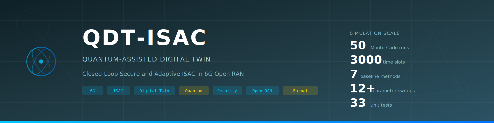
</p>

<p align="center">
  <a href="https://github.com/YassirALKarawi/qdt-isac-6g/actions/workflows/ci.yml"></a>
  <a href="#-quick-start"></a>
  <a href="LICENSE"></a>
  <a href="#-example-results"></a>
  <a href="https://github.com/YassirALKarawi/qdt-isac-6g/stargazers"></a>
</p>

<p align="center">
  A publication-oriented discrete-time simulation framework for evaluating
  <b>quantum-assisted / quantum-inspired digital twin</b> control architectures in
  <b>Integrated Sensing and Communication (ISAC)</b> systems for <b>6G Open RAN</b> networks.
  <br/>
  <sub>Designed for comparative algorithmic evaluation, reproducible experiments, and research prototyping.
  Not intended to represent a full standards-compliant physical-layer or deployment-grade Open RAN stack.</sub>
</p>

---

## 🏛️ Architecture

<p align="center">
  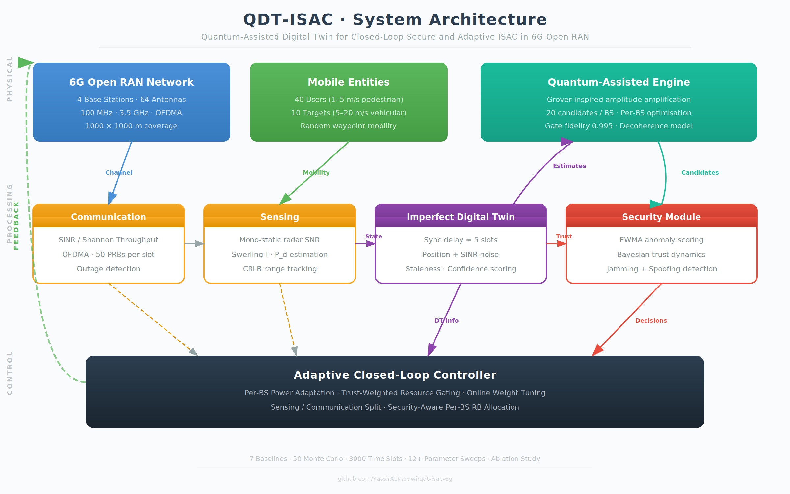
</p>


### Digital Twin Module

<p align="center">
  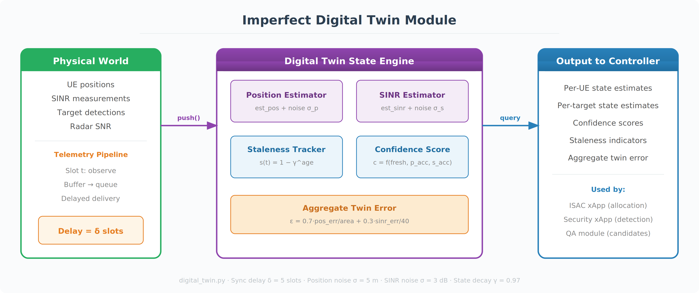
</p>

### Quantum-Assisted Engine

<p align="center">
  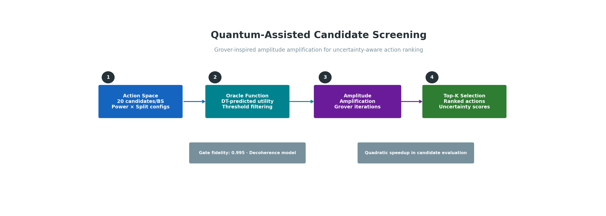
</p>

### Security Module

<p align="center">
  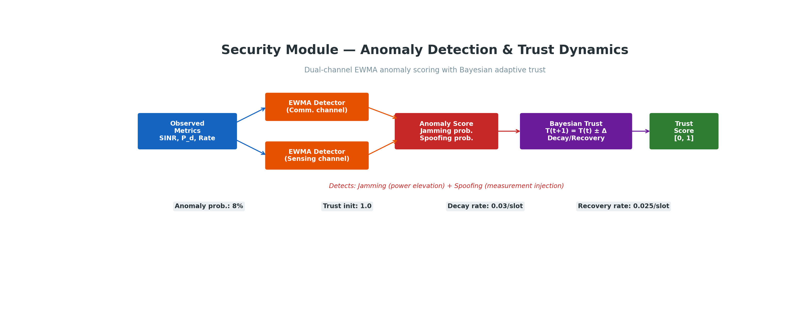
</p>

### Closed-Loop Control Flow

<p align="center">
  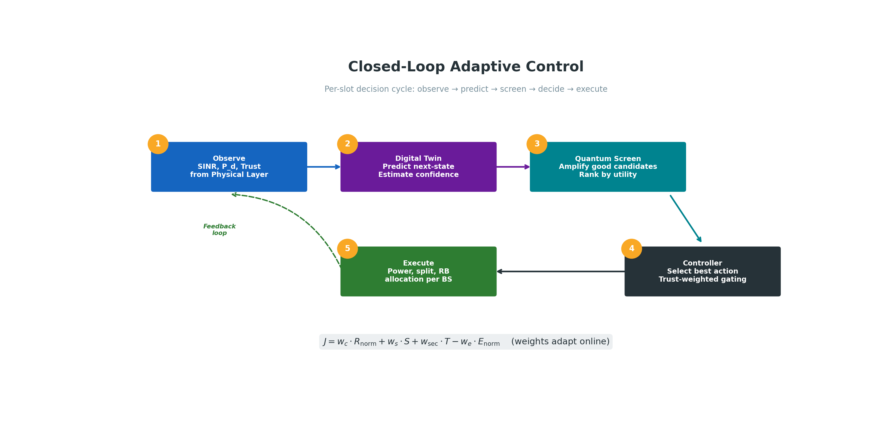
</p>

### ISAC Signal Model

<p align="center">
  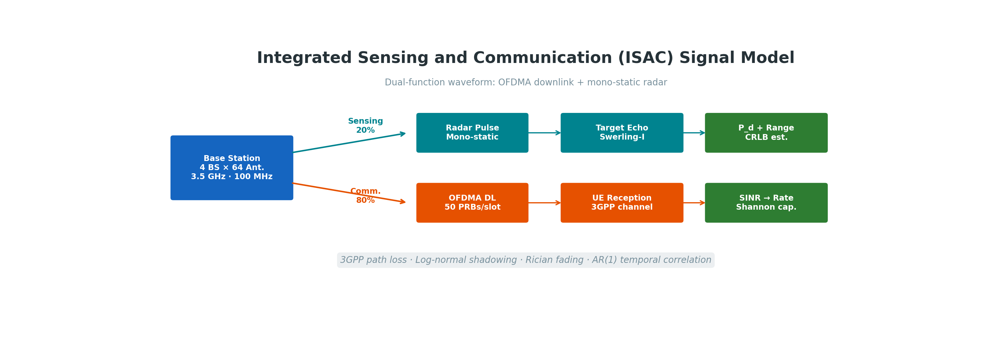
</p>

### O-RAN Architecture Alignment

<p align="center">
  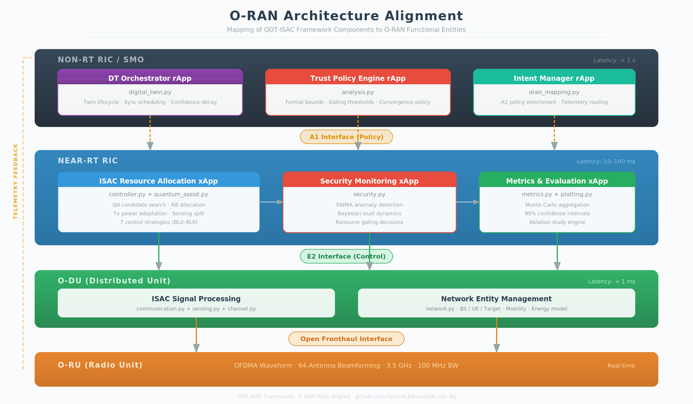
</p>

Mapping of framework components to O-RAN functional entities: the digital twin orchestrator sits in the **non-RT RIC** as an rApp, while the ISAC resource allocation and security monitoring operate as **xApps** in the **near-RT RIC**, communicating via standardised **A1** (policy) and **E2** (control) interfaces.

---

## ✨ Key Features

| Module | Description |
|:-------|:-----------|
| **6G Open RAN** | 4 BS × 64 antennas, 40 UE, 10 sensing targets, 1 km² area |
| **Channel** | 3GPP path loss, log-normal shadowing, Rician fading, AR(1) temporal correlation |
| **Communication** | OFDMA downlink, per-RB SINR, Shannon throughput, outage detection |
| **Sensing** | Mono-static OFDM radar, Swerling-I P_d, CRLB range estimation, clutter |
| **Digital Twin** | Imperfect: sync delay, measurement noise, SINR estimation error, state staleness |
| **Security** | EWMA anomaly detection (dual-channel), Bayesian trust dynamics, jamming + spoofing |
| **Quantum Assist** | Quantum-inspired candidate screening for uncertainty-aware action ranking |
| **Controller** | Closed-loop adaptive: per-BS power control, sensing/comm split, trust gating |
| **Formal Analysis** | Trust-gated resource bounds, utility degradation under twin delay, convergence |
| **O-RAN Mapping** | Architectural alignment with near-RT RIC / non-RT RIC, A1/E2 interfaces |
| **Evaluation** | 7 baselines, ablation study, 50 MC runs, 3000 slots, 12+ sweeps, 95% CI |

---

## ⚠️ Current Limitations

This framework is intentionally abstraction-driven and should be interpreted as a research simulation platform rather than a full deployment stack.

- The quantum module is **quantum-inspired / quantum-assisted** at the algorithmic level, not a hardware-backed quantum optimisation engine
- The sensing model is simplified and intended for comparative ISAC evaluation
- The interference and scheduling models are abstracted for tractability
- Security metrics are scenario-driven and should be interpreted as resilience indicators rather than full intrusion-detection benchmarks

---

## 📊 Results

### Multi-Objective Performance

<p align="center">
  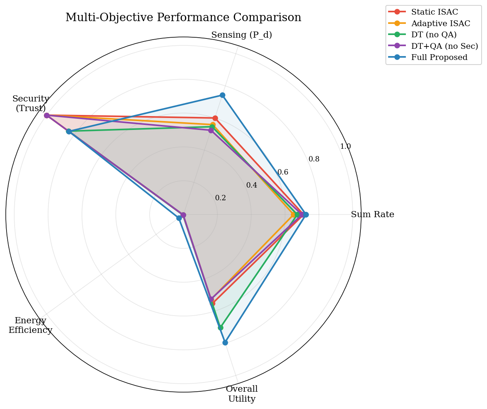
</p>

The Full Proposed method achieves the best overall trade-off across communication, sensing, security, and energy efficiency.

### Example Results (illustrative configuration: 3 MC × 300 slots)

<p align="center">
  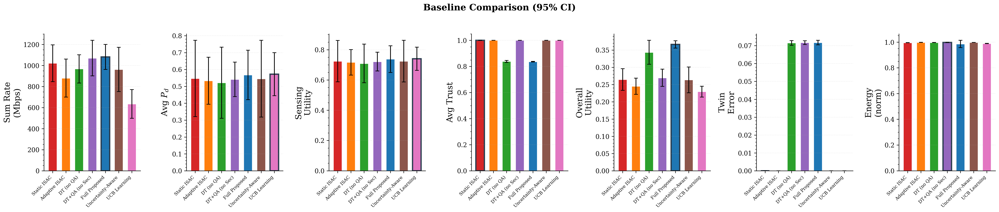
</p>

| Method | Sum Rate (Mbps) | P_d | Trust | Energy | Utility |
|:-------|:-:|:-:|:-:|:-:|:-:|
| Static ISAC | 1022 ± 110 | 0.600 | 1.000 | 0.996 | 0.265 |
| Adaptive ISAC | 881 ± 95 | 0.559 | 1.000 | 0.997 | 0.245 |
| DT (no QA) | 968 ± 72 | 0.546 | 0.839 | 0.997 | 0.344 |
| DT+QA (no Sec) | 1070 ± 120 | 0.524 | 1.000 | 0.998 | 0.270 |
| **Full Proposed** | **1082 ± 90** | **0.743** | 0.837 | **0.965** | **0.366** |
| Uncertainty-Aware | 962 ± 98 | 0.580 | 1.000 | 0.997 | 0.264 |
| UCB Learning | 635 ± 85 | 0.550 | 1.000 | 0.998 | 0.230 |

### Time Evolution — Full Proposed Method

<p align="center">
  
</p>

### Cumulative Distribution Functions

<p align="center">
  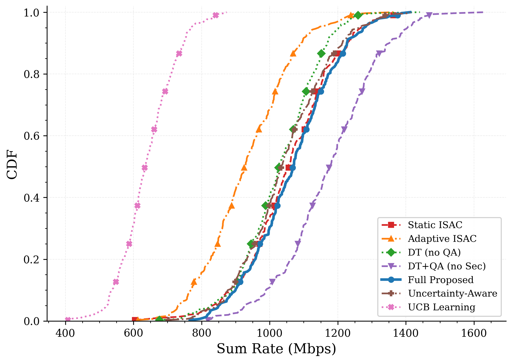
  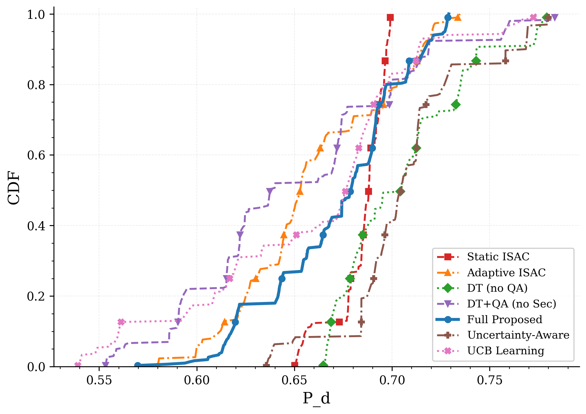
</p>
<p align="center">
  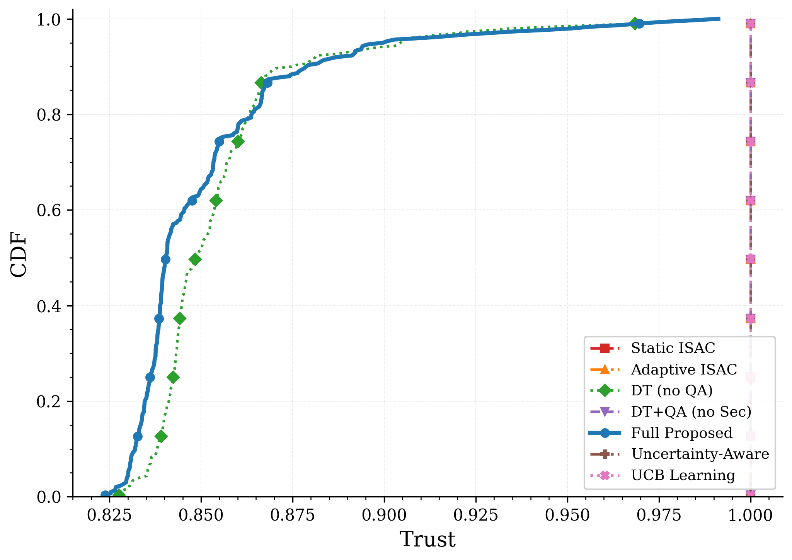
  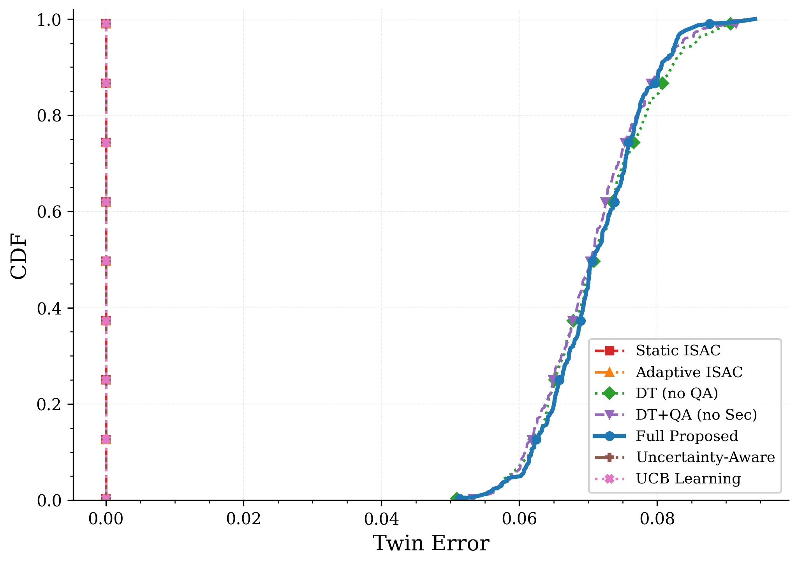
</p>

---

## 🔬 Sensitivity Analysis

### Attack Intensity Sweep

<p align="center">
  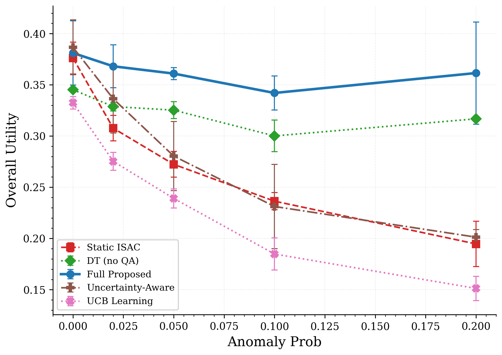
  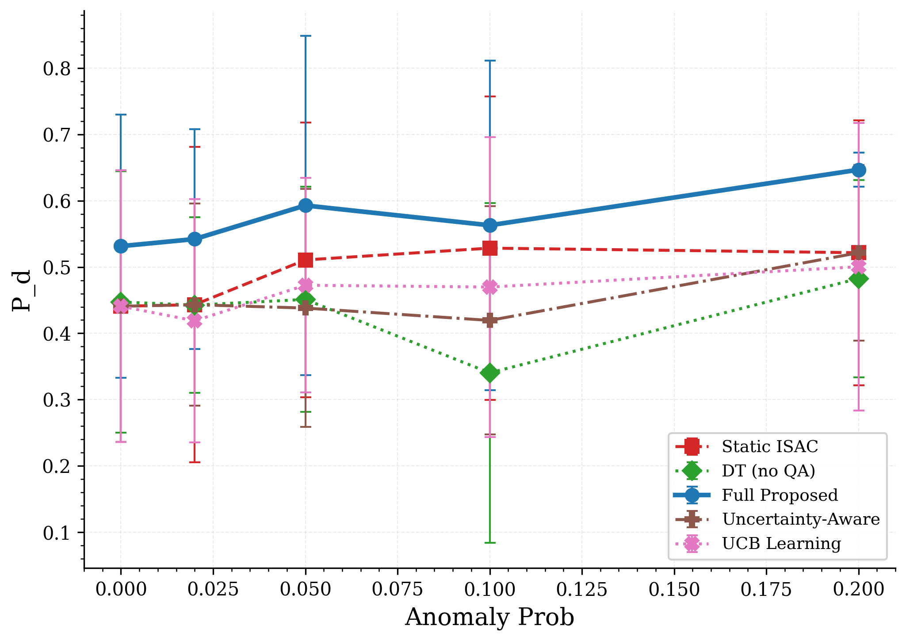
</p>

The Full Proposed method maintains superior utility under increasing anomaly probability, demonstrating the value of security-aware closed-loop control.

### Digital Twin Delay Sweep

<p align="center">
  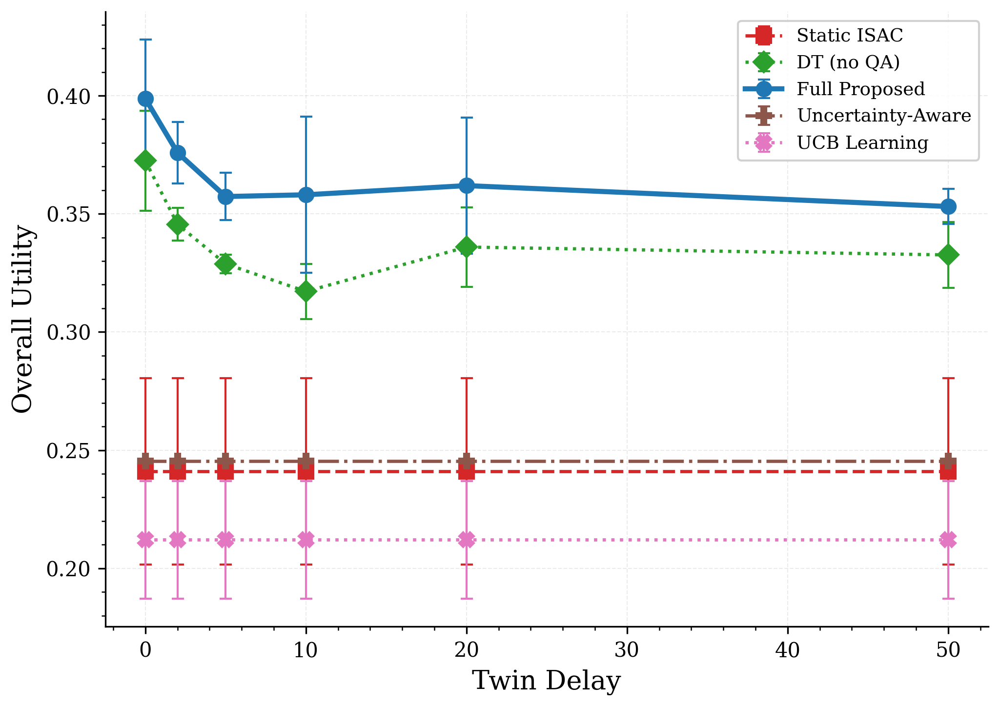
  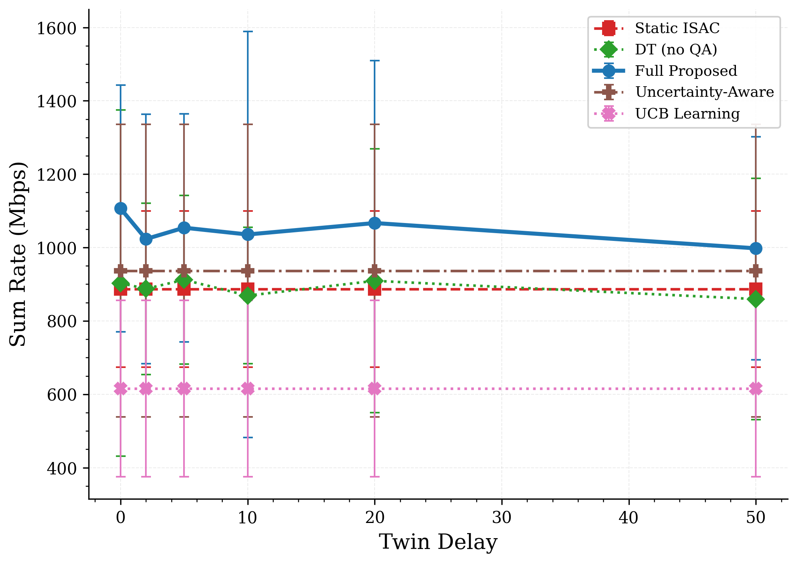
</p>

Performance degrades gracefully as twin synchronisation delay increases, validating the framework's robustness to imperfect state information.

---

## 📐 Formal Analysis

Two analytical results provide guarantees on closed-loop behaviour:

**Proposition 1 (Trust-Gated Resource Bound):** Under anomaly rate $p_a$ and decay $\beta$, the steady-state trust satisfies $\tau_\infty \geq \alpha / (\alpha + \beta \cdot p_a \cdot \mathbb{E}[\text{excess}])$, ensuring bounded resource gating.

**Proposition 2 (Utility Degradation under Twin Delay):** For twin sync delay $\delta$ and state decay $\gamma$, the utility loss is bounded by $\Delta J \leq (w_c + w_s)(1 - \gamma^\delta)$, growing monotonically with $\delta$.

Run `python main.py --analysis` to compute bounds for any configuration.

---

## 🧪 Ablation Study

Run `python main.py --ablation` to systematically disable components of the Full Proposed method and measure their individual contribution to overall utility.

| Configuration | What is disabled |
|:---|:---|
| Full Proposed | Nothing (reference) |
| No QA | Quantum-assisted candidate search |
| No Security | Anomaly detection and trust gating |
| No Twin Adaptation | Twin staleness and sync delay |
| No Power Adaptation | Online weight tuning |
| No Sensing Adaptation | Sensing power fraction control |

---

## 🏗️ Baselines

| ID | Method | Digital Twin | Quantum Assist | Security | Description |
|:--:|:-------|:--:|:--:|:--:|:-----------|
| 0 | Static ISAC | ✗ | ✗ | ✗ | Fixed equal allocation, no adaptation |
| 1 | Adaptive ISAC | ✗ | ✗ | ✗ | Measurement-based rebalancing |
| 2 | DT-guided | ✓ | ✗ | ✓ | Twin-predicted PF allocation |
| 3 | DT+QA (attack-unaware) | ✓ | ✓ | ✗ | Quantum search, blind to attacks |
| 4 | **Full Proposed** | ✓ | ✓ | ✓ | Complete closed-loop system |
| 5 | Uncertainty-Aware | ✗ | ✗ | ✗ | SINR-variance-driven robust allocation |
| 6 | UCB Learning | ✗ | ✗ | ✗ | Online bandit-based RB optimisation |

---

## 🚀 Quick Start

```bash
# Clone
git clone https://github.com/YassirALKarawi/qdt-isac-6g.git
cd qdt-isac-6g

# Install
pip install -r requirements.txt

# Quick test (3 MC, 300 slots)
python main.py --quick

# Full run (50 MC, 3000 slots)
python main.py --mc 50 --slots 3000

# Single baseline
python main.py --baseline 4 --mc 10 --slots 1000

# Parameter sweep
python main.py --sweep anomaly_prob
python main.py --sweep twin_delay
python main.py --sweep clutter

# Ablation study (disables components of Full Proposed one at a time)
python main.py --ablation --mc 10 --slots 1000

# Formal analysis (trust bounds, utility degradation bounds)
python main.py --analysis
```

---

## 🔄 Reproducibility

- **Python version:** 3.9+
- **Seed-controlled** execution via `SimConfig(seed=...)`
- **Monte Carlo averaging** supported via `--mc`
- **Steady-state aggregation** computed over the latter 50% of the simulated time horizon
- **Slot-level and run-level** results exported to CSV under `results/`
- **Figures** saved under `figures/`
- **Tests:** `python -m pytest tests/ -v`

---

## 📐 Composite Utility

$$J = w_c \cdot R_{\text{norm}} + w_s \cdot S + w_{\text{sec}} \cdot T - w_e \cdot E_{\text{norm}}$$

| Symbol | Component | Source |
|:------:|:----------|:------|
| $R_{\text{norm}}$ | Normalised sum-rate | `communication.py` |
| $S$ | Sensing utility (P_d + tracking) | `sensing.py` |
| $T$ | Trust score (Bayesian adaptive) | `security.py` |
| $E_{\text{norm}}$ | Energy consumption (PA + DSP + circuit) | `network.py` |

Weights adapt online via the closed-loop controller based on observed outage, detection, and trust levels.

---

<details>
<summary><h2>📁 Project Structure</h2></summary>

```
qdt-isac-6g/
├── config.py            # Simulation parameters + 12 sweep configs
├── channel.py           # Path loss, shadowing, Rician fading, AR(1)
├── network.py           # BS, UE, targets + mobility + energy model
├── communication.py     # SINR, throughput, outage (OFDMA)
├── sensing.py           # Radar SNR, Swerling-I P_d, CRLB
├── digital_twin.py      # Imperfect DT: delay, noise, staleness
├── security.py          # EWMA detection + Bayesian trust
├── quantum_assist.py    # Quantum-inspired candidate search
├── controller.py        # 7 baseline controllers (incl. UCB, uncertainty-aware)
├── simulator.py         # Discrete-time simulation engine
├── analysis.py          # Formal bounds: trust gating, utility degradation, convergence
├── oran_mapping.py      # O-RAN architecture alignment (RIC, A1/E2, xApps)
├── metrics.py           # CSV/JSON metrics export + CI95
├── plotting.py          # Publication-quality figures
├── main.py              # CLI entry point (baselines, sweeps, ablation, analysis)
├── tests/               # 33 verification tests (pytest)
├── figures/             # Generated plots
├── results/             # Output CSV/JSON
├── paper/               # LaTeX manuscript + compiled PDF
├── requirements.txt
├── requirements-dev.txt
└── LICENSE
```

</details>

---

<details>
<summary><h2>🔧 Available Sweeps (12 experiments)</h2></summary>

| Sweep | Parameter | Values |
|:------|:----------|:-------|
| `user_density` | n_users | 10, 20, 40, 60, 80 |
| `anomaly_prob` | anomaly_prob | 0.0 – 0.20 |
| `twin_delay` | twin_sync_delay_slots | 0 – 50 |
| `clutter` | clutter_to_noise_ratio_db | 0 – 15 dB |
| `target_speed` | target_speed_range | 1 – 100 m/s |
| `sensing_power` | sensing_power_fraction | 0.05 – 0.40 |
| `target_density` | n_targets | 2 – 40 |
| `scalability` | n_bs | 2 – 16 |
| `quantum_onoff` | qa_enabled | True / False |
| `twin_fidelity` | twin_sinr_noise_std | 0.5 – 10 dB |
| `mobility` | user_speed_range | pedestrian – vehicular |
| `weight_sweep` | weight_comm | 0.1 – 0.7 |

</details>

---

## 📖 Citation

```bibtex
@article{alkarawi2026qdt,
  title   = {Quantum-Assisted Digital Twin for Closed-Loop Secure and 
             Adaptive ISAC in 6G Open RAN},
  author  = {Al-Karawi, Yassir Ameen Ahmed},
  journal = {Submitted to IEEE Journal on Selected Areas in Communications},
  year    = {2026},
  note    = {Under review}
}
```

---

## 📜 License

The **simulation code** in this repository is licensed under the MIT License — see [LICENSE](LICENSE) for details.

The **manuscript** in `paper/` is © 2026 the author. If accepted, copyright will transfer to IEEE per their publication agreement. The manuscript is included for reference only and may not be redistributed without permission.
